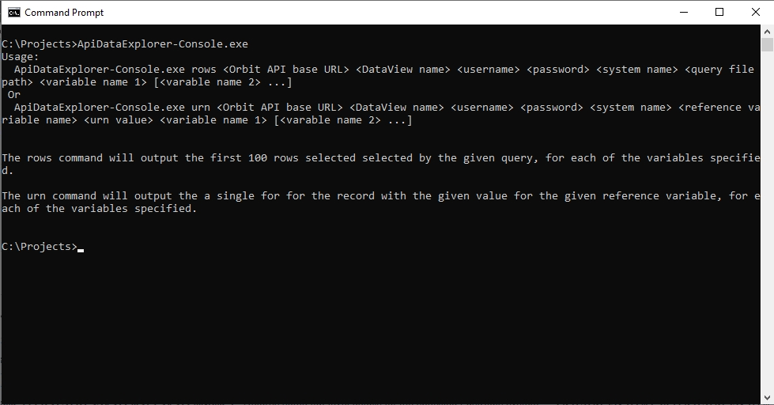
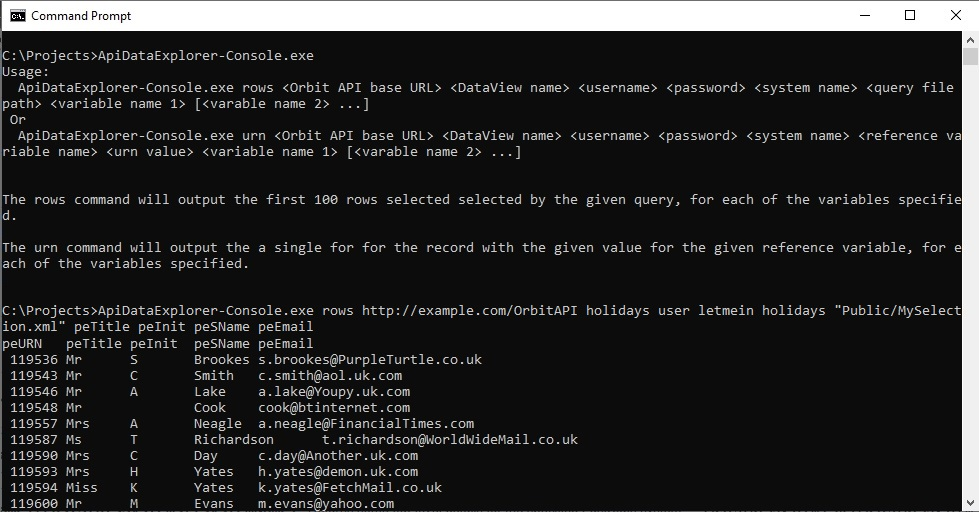
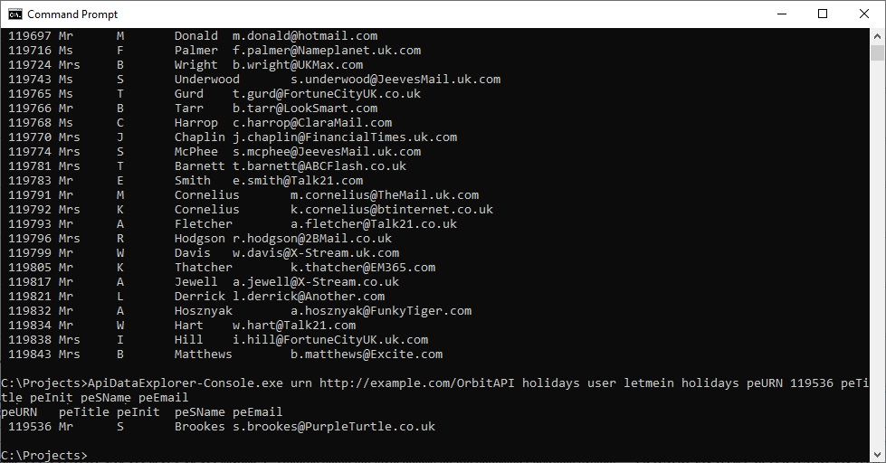

# ApiDataExplorer
This is a very simple application that connects to the Apteco API and given the path to a saved selection file and
some variable names will allow you to view some data from a running 
[Apteco FastStats®](https://www.apteco.com/products/faststats) system.

### Background
Apteco FastStats® is part of the [Apteco Marketing Suite](http://www.apteco.com).  It provides a unique
combination of speed and power for data exploration, data mining analysis and customer understanding.

The Apteco API provides programmatic access to information held in an Apteco FastStats® database, as
well as reporting information generated from [Apteco PeopleStage™](https://www.apteco.com/products/peoplestage),
the powerful multi channel campaign automation software.

The ApiDataExplorer is a sample application that connects to a Apteco FastStats® system via the
Apteco API to demonstrate how to export some data.

### Usage
To use the ApiDataExplorer, download the latest release from [GitHub](https://github.com/Apteco/ApiDataExplorer/releases)
or build the software via Visual Studio or the .Net Core CLI (see [below](#Build)).

To find out what command line parameters are required, run the console application with no parameters:



You will need various pieces of information:

* The name of a DataView to connect to and a valid username and password for that DataView
* The name of a FastStats system inside that DataView to analyse.

If you are outputting a set of records for a saved selection then you will also need:

* The path to a saved selection created with [Apteco FastStats®](https://www.apteco.com/products/faststats).
This selection must be saved in your public or private directory.
* A list of variable references to output data for.



If you want to output a data for a single record then you will need:

* The name of the reference (URN - Unique Reference Number) variable you want to use to identify the record.
* The URN value for this variable.
* A list of variable references to output data for.



### What the API Data Explorer does

When you use the API Data Explorer to return a set of rows for a saved selection file the API Data Explorer runs
through the following steps:

1. Logs in to the API at the specified URL
2. Gets the definition of a saved query from the `/{dataViewName}/Queries/{systemName}/GetFileSync` endpoint.
3. Gets the resolve table for the query and looks up the reference (URN) variable for this table. The endpoint used is
`/{dataViewName}/FastStatsSystems/{systemName}/Variables` with a filter applied. 
4. If there is a reference variable found this is added to the list of variables the user provided on the command line.
5. Creates a set of export column definitions from the list of variable names provided on the command line.
6. Submits an export request with the given query and list of columns.  The endpoint used is
`/{dataViewName}/Exports/{systemName}/ExportSync` 
7. Outputs the resulting rows to the console.

When you use the API Data Explorer to return a single row for a given reference variable value the API Data Explorer
runs through the following steps:

1. Logs in to the API at the specified URL
2. Gets information for the specified reference variable from the
`/{dataViewName}/FastStatsSystems/{systemName}/Variables/{variableName}` endpoint.
3. Creates a query definition to select just a single row with the given URN value for this reference variable.
4. Creates a set of export column definitions from the list of variable names provided on the command line.
5. Submits an export request with the given single-record query and list of columns.  The endpoint used is
`/{dataViewName}/Exports/{systemName}/ExportSync` 
7. Outputs the resulting rows to the console.

### Implementation
* To see how the ApiClient code was generated from the API's Swagger specification, look at the
Readme in the [Apteco.ApiDataExplorer.ApiClient](Apteco.ApiDataExplorer.ApiClient) project.

* The [Apteco.ApiDataExplorer.Core](Apteco.ApiDataExplorer.Core) project contains the business logic for the
application (as described above).

* The [Apteco.ApiDataExplorer.Console](Apteco.ApiDataExplorer.Console) project contains a console application
entry point that simply gathers the command line parameters and starts the processing.

### Build
To build the project, either do so via Visual Studio (2017 or later) or using the dotnet CLI tool.

##### Visual Studio
Open the ApiDataExplorer.sln file in Visual Studio and build the project.

To generate the standalone executable, right-click on the Apteco.ApiDataExplorer.Console project and choose "Publish...".
Then choose the "Folder Profile" and publish that.  The binaries will be compiled into
`Apteco.ApiDataExplorer.Console\bin\Release\netcoreapp2.1\win-x64`

##### dotnet CLI
To build the project so that it will run under any archirecture that .Net Core supports (Windows, Mac OSX, Linux), go to the
root directory and run `dotnet build`.  This will compile the code so that it can be run using the commands:

```
cd Apteco.ApiDataExplorer.Console\bin\Debug\netcoreapp2.1
dotnet ApiDataExplorer-Console.dll
```

To build a .exe file that will run on the Windows 64 bit platform, go to the root directory and run 
```
dotnet publish -c Release -r win-x64
```

The binaries will be compiled into
`Apteco.ApiDataExplorer.Console\bin\Release\netcoreapp2.1\win-x64`
